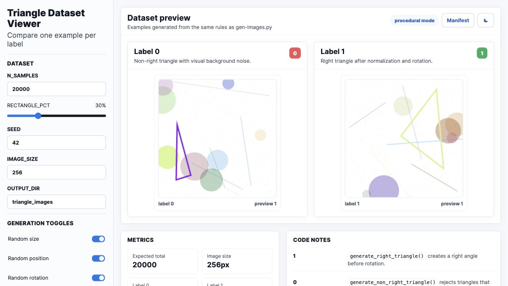

# Triangle Dataset Viewer

Standalone viewer for generating and inspecting procedural triangle dataset examples for binary classification.

## Live Demo

[Open the Vercel deployment](https://dataset-viewer-one.vercel.app)



## Features

- Generates preview samples for label `0` and label `1`.
- Controls sample count, rectangle percentage, seed, image size, and visual randomization.
- Explains the generation rules and expected dataset distribution.
- Single-file static app, deployable without a backend.

## Run Locally

```bash
python3 -m http.server 8776
```

Then open:

```text
http://localhost:8776
```

## Project Structure

```text
index.html       Full standalone viewer
docs/            README screenshot assets
```
